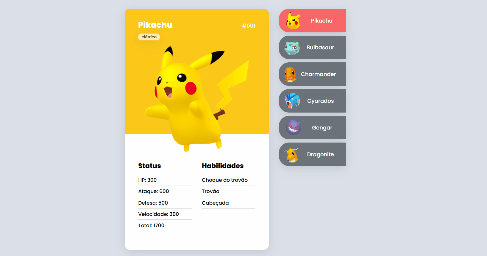
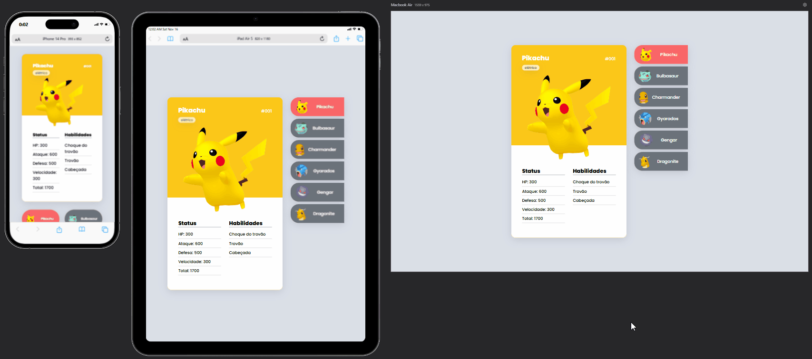

<h1 align="center" style="color: yellow">Pokedex</h1>

    <h2>Prévia</h2>

 
 

<h2>Tecnologias</h2>

<picture style="display: flex; heigth: 96px; width: 96px; align-items: center; justify-content: center; gap: 25px;">

</picture>

 
 

    <h2>Responsivo</h2>

Projeto responsivo em várias telas como mobile, tablet e desktop

 
 

    <h2>Desafio</h2>

Este projeto tive como desafio a interação com o JavaScript. Como foi a minha primeira experiência com a tecnologia, fiquei bastante animado e obtive um excelente aprendizado (mesmo que pequeno), mas que me deu uma base solida para encarar os próximos desafios !

